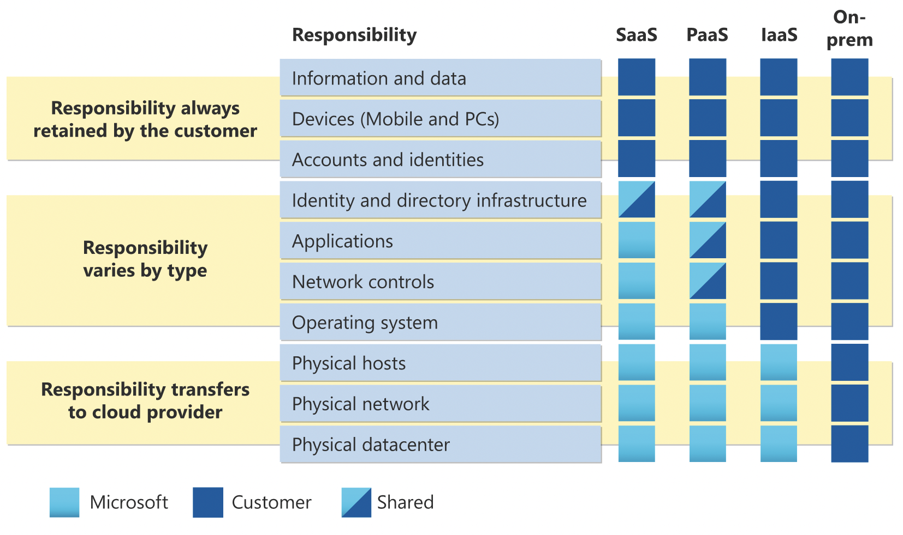
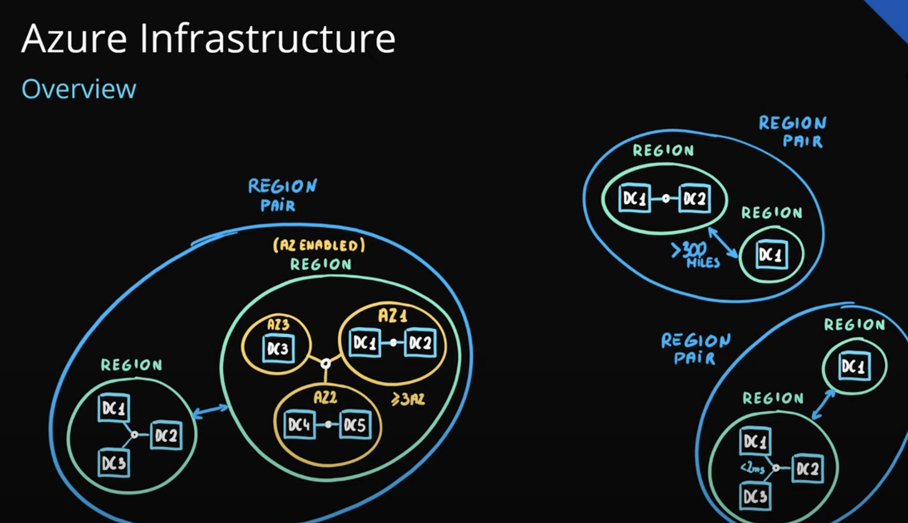
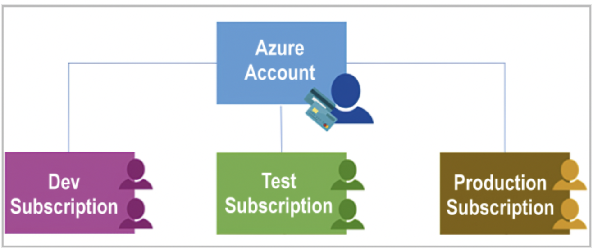
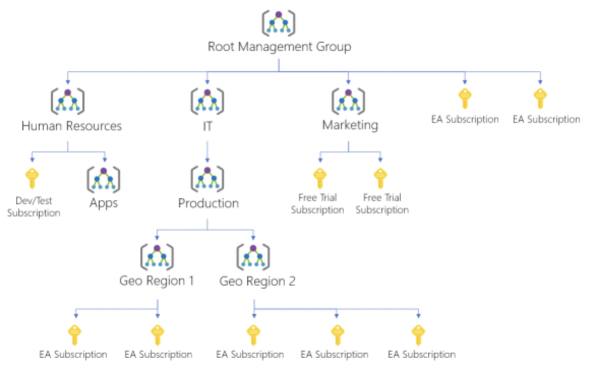
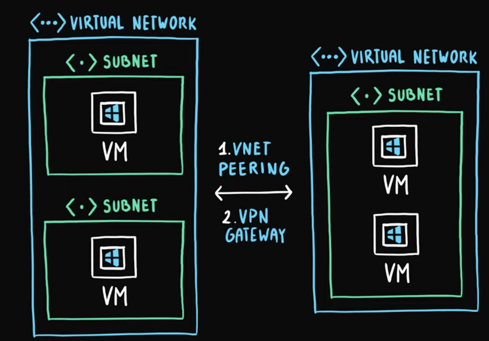
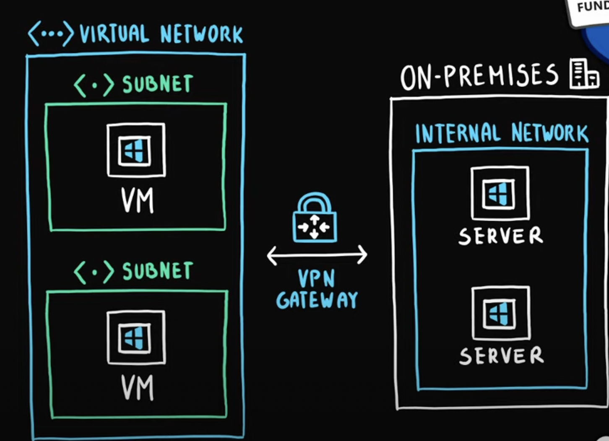
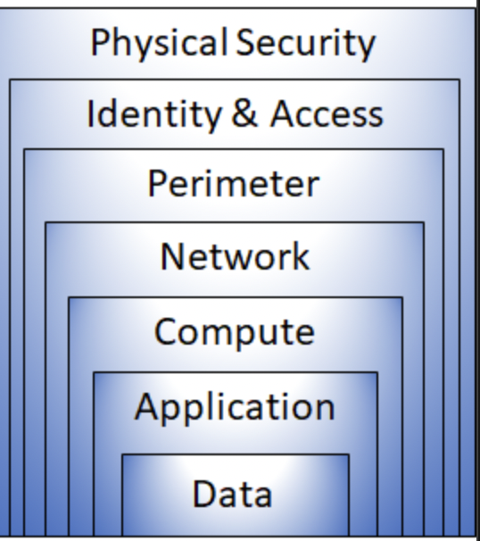
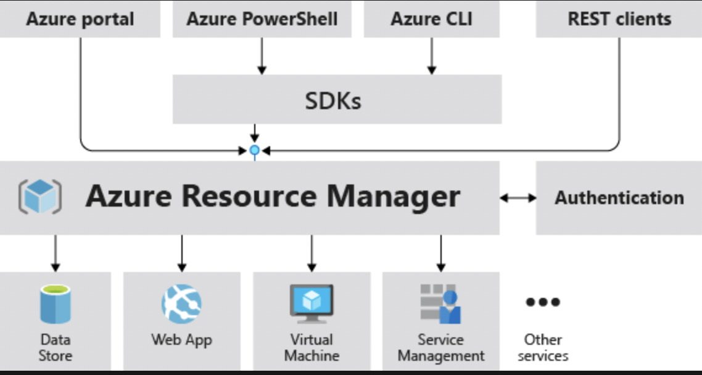
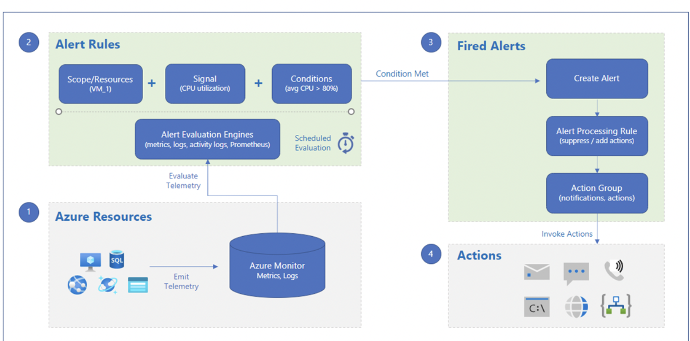

# AZ-900

## Describe cloud concepts (25–30%)

### Define cloud computing

Delivery of computing services—including servers, storage, databases, networking, software, analytics, and intelligence—over the Internet to offer faster innovation, flexible resources, and economies of scale.

You typically pay only for cloud services you use, helping you lower your operating costs, run your infrastructure more efficiently, and scale as your business needs change.

### Describe the shared responsibility model

For all cloud deployment types, you own your data and identities. You are responsible for protecting the security of your data and identities, on-premises resources, and the cloud components you control (which varies by service type).

Regardless of the type of deployment, the following responsibilities are always retained by you:

* Data
* Endpoints
* Account
* Access management

### Define cloud models, including public, private, and hybrid

#### Hybrid Cloud

Type of cloud computing that combines on-premises infrastructure—or a private cloud—with a public cloud. Hybrid clouds allow data and apps to move between the two environments.

Advantages of the hybrid cloud:

* **Control**: your organization can maintain a private infrastructure for* sensitive assets or workloads that require low latency.

* **Flexibility**: you can take advantage of additional resources in the public cloud when you need them.
  
* **Cost-effectiveness**: with the ability to scale to the public cloud, you* pay for extra computing power only when needed.
  
* **Ease**: transitioning to the cloud doesn’t have to be overwhelming because* you can migrate gradually—phasing in workloads over time.

#### Public Cloud

The most common type of cloud computing deployment. The cloud resources (like servers and storage) are owned and operated by a third-party cloud service provider and delivered over the internet.

Advantages of public clouds:

* **Lower costs**: no need to purchase hardware or software, and you pay only* for the service you use.

* **No maintenance**: your service provider provides the maintenance.

* **Near-unlimited scalability**: on-demand resources are available to meet* your business needs.

* **High reliability**: a vast network of servers ensures against failure.

#### Private Cloud

Cloud computing resources used exclusively by one business or organization. The private cloud can be physically located at your organization’s on-site datacenter, or it can be hosted by a third-party service provider.

But in a private cloud, the services and infrastructure are always maintained on a private network and the hardware and software are dedicated solely to your organization.

Advantages of a private cloud:

* **More flexibility**: your organization can customize its cloud environment to meet specific business needs.

* **More control**: resources are not shared with others, so higher levels of control and privacy are possible.

* **More scalability**: private clouds often offer more scalability compared to on-premises infrastructure.

### Identify appropriate use cases for each cloud model

* *Public*: when you want the benefits from cloud services like opex model, scablability, and your not worried about a specific requirements or being on a shared platform.

* *Private*: when you want full control over the physical hardware and configuration of the server for the cloud. Especially for compliance (medical, goverment)

* *Hybrid*: when you benifits of public and private. You can keep data and compliance things on prem and use the public side for compute resources

### Describe the consumption-based model

Customers are only charged based on their resource usage.

* No associated upfront cost.
* No wasted resources as such no charges are incurred for unused resources*. Unused in this case is different per service. For instance, blob storage that stores any data is considered to be used, as it consumes the storage space. Virtual Machines that are running consume CPU, memory and other resources even if there isn’t any traffic. Hence they are considered to be used and will incur charges.
* Pay for what you need.
* Stop paying when you don’t.

### Compare cloud pricing models

* **CapEx** is the spending of money on physical infrastructure upfront and then deducting that expense from your tax bill over time. CapEx is an upfront cost, which has a value that reduces over time and usually has no recurring cost.

* **OpEx** is spending money on services or products now and being billed for them now. You can deduct this expense from your tax bill in the same year. There’s no upfront cost but has a recurring cost. You pay for a service or product as you use it i.e. pay-as-you-go pricing.

### Describe the benefits of using cloud services

#### Describe the benefits of high availability and scalability in the cloud

Azure is a highly available cloud environment with uptime guarantees depending on the service. These guarantees are part of the service-level agreements (**SLAs**).

* **Scalability**: refers to the ability to adjust resources to meet demand. If you suddenly experience peak traffic and your systems are overwhelmed, the ability to scale means you can add more resources to better handle the increased demand.

  The other benefit of scalability is that you aren't overpaying for services. Because the cloud is a consumption-based model, you only pay for what you use.

* **Vertical scaling**: if you were developing an app and you needed more processing power, you could vertically scale up to add more CPUs or RAM to the virtual machine. Conversely, if you realized you had over-specified the needs, you could vertically scale down by lowering the CPU or RAM specifications.

* **Horizontal scaling**: if you suddenly experienced a steep jump in demand, your deployed resources could be scaled out (either automatically or manually). For example, you could add additional virtual machines or containers, scaling out. In the same manner, if there was a significant drop in demand, deployed resources could be scaled in (either automatically or manually), scaling in.

#### Describe the benefits of reliability and predictability in the cloud

* **Reliability**: ability of a system to recover from failures and continue to function.

* **Predictability**  lets you move forward with confidence. Predictability can be focused on performance predictability or cost predictability.

#### Describe the benefits of security and governance in the cloud

* **Governance** and compliance: Things like set templates help ensure that all your deployed resources meet corporate standards and government regulatory requirements. Plus, you can update all your deployed resources to new standards as standards change.

* **Security**: you can find a cloud solution that matches your security needs. If you want maximum control of security, infrastructure as a service provides you with physical resources but lets you manage the operating systems and installed software, including patches and maintenance.

#### Describe the benefits of manageability in the cloud

* Automatically scale resource deployment based on need.

* Deploy resources based on a preconfigured template, removing the need for manual * configuration.

* Monitor the health of resources and automatically replace failing resources.

* Receive automatic alerts based on configured metrics, so you’re aware of performance * in real time.

#### Describe infrastructure as a service (IaaS)

The most flexible category of cloud services, as it provides you the maximum amount of control for your cloud resources.

In an IaaS model, the cloud provider is responsible for maintaining the hardware, network connectivity (to the internet), and physical security. You’re responsible for everything else: operating system installation, configuration, and maintenance; network configuration; database and storage configuration; and so on.

With IaaS, **you’re essentially renting the hardware in a cloud datacenter**, but what you do with that hardware is up to you.

#### Describe platform as a service (PaaS)

Is a middle ground between renting space in a datacenter (infrastructure as a service) and paying for a complete and deployed solution (software as a service).

In a PaaS environment, the cloud provider maintains the physical infrastructure, physical security, and connection to the internet. They also maintain the operating systems, middleware, development tools, and business intelligence services that make up a cloud solution. In a PaaS scenario, you don't have to worry about the licensing or patching for operating systems and databases.

PaaS is well suited to provide a complete development environment without the headache of maintaining all the development infrastructure.

#### Describe software as a service (SaaS)

The most complete cloud service model from a product perspective. **With SaaS, you’re essentially renting or using a fully developed application**. Email, financial software, messaging applications, and connectivity software are all common examples of a SaaS implementation.

While the SaaS model may be the least flexible, it’s also the easiest to get up and running. It requires the least amount of technical knowledge or expertise to fully employ.

#### Identify appropriate use cases for each cloud service (IaaS, PaaS, SaaS)

TODO

## Describe Azure architecture and services (35–40%)

### Describe Azure regions, region pairs, and sovereign regions

* **Azure geography**: is a discrete market, typically containing at least one or more regions, that preserves data residency and compliance boundaries.

* **Azure regions**: geographical area on the planet that contains at least one but potentially multiple datacenters that are nearby and networked together with a low-latency network.

* **Region pair**: Each Azure region is always paired with another region within the same geography (such as US, Europe, or Asia) *at least 300 miles away*. This approach allows for the replication of resources (such as VM storage) across a geography to help reduce the likelihood of interruptions due to catastrophic events

* **Sovereign regions**: Certain regions are dedicated to specific sovereign entities. Although all regions are Azure regions, these sovereign regions are isolated from the rest of Azure.

### Describe availability zones

Availability zones are physically separate datacenters within an Azure region. Each availability zone is made up of one or more datacenters equipped with independent power, cooling, and networking. An availability zone is set up to be an isolation boundary. If one zone goes down, the other continues working. Availability zones are connected through high-speed, private fiber-optic networks.

### Describe Azure datacenters

Unique physical buildings located all over the globe that house a group of networked computer servers.

### Describe Azure resources and resource groups

* **Resource**: A manageable item that's available through Azure. Virtual machines (VMs), storage accounts, web apps, databases, and virtual networks are examples of resources.
  
* **Resource group**: A container that holds related resources for an Azure solution. The resource group includes resources that you want to manage as a group. You decide which resources belong in a resource group based on what makes the most sense for your organization.

### Describe subscriptions

Using Azure requires an Azure subscription.

A subscription provides you with authenticated and authorized access to Azure products and services. It also allows you to provision resources. An Azure subscription is a logical unit of Azure services that links to an Azure account, which is an identity in Azure Active Directory (Azure AD) or in a directory that Azure AD trusts.

There are two types of subscription boundaries that you can use:

1 - Billing boundary: This subscription type determines how an Azure account is billed for using Azure. You can create multiple subscriptions for different types of billing requirements.

2 - Access control boundary: Azure applies access-management policies at the subscription level, and you can create separate subscriptions to reflect different organizational structures.

### Describe management groups

Provide a **level of scope above subscriptions**.

You organize subscriptions into containers called management groups and apply your governance conditions to the management groups. All subscriptions within a management group automatically inherit the conditions applied to the management group.

### Describe the hierarchy of resource groups, subscriptions, and management groups

You can build a flexible structure of management groups and subscriptions to organize your resources into a hierarchy for unified policy and access management. The following diagram shows an example of creating a hierarchy for governance by using management groups.

### Compare compute types, including container instances, virtual machines (VMs), and functions

* **Container Instances**: offer the fastest and simplest way to run a container in Azure; without having to manage any virtual machines or adopt any additional services. Azure Container Instances are a platform as a service (**PaaS**) offering. Azure Container Instances allow you to upload your containers and then the service will run the containers for you.

* **VMs**: provide infrastructure as a service (**IaaS**) in the form of a virtualized server and can be used in many ways. Just like a physical computer, you can customize all of the software running on your VM.

* **Azure Function**s: is an event-driven, (**FaaS**) serverless compute option that doesn’t require maintaining virtual machines or containers, an event wakes the function, alleviating the need to keep resources provisioned when there are no events.Functions are a key component of serverless computing, they scale automatically based on demand.

### Describe VM options, including Azure Virtual Machines, Azure Virtual Machine Scale Sets,availability sets, and Azure Virtual Desktop

* **VMs**: provide infrastructure as a service (**IaaS**) in the form of a virtualized server and can be used in many ways. Just like a physical computer, you can customize all of the software running on your VM.

* **Scale sets**: allow you to centrally manage, configure, and update a large number of VMs in minutes. The number of VM instances can automatically increase or decrease in response to demand, or you can set it to scale based on a defined schedule. Virtual machine scale sets also automatically deploy a load balancer to make sure that your resources are being used efficiently. With virtual machine scale sets, you can build large-scale services for areas such as compute, big data, and container workloads.

* **Availability sets**: are designed to ensure that VMs stagger updates and have varied power and network connectivity, preventing you from losing all your VMs with a single network or power failure.
  Availability sets do this by grouping VMs in two ways: 
  
  Update domain: The update domain groups VMs that can be rebooted at the same time. This allows you to apply updates while knowing that only one update domain grouping will be offline at a time. All of the machines in one update domain will be updated.
  
  Fault domain: The fault domain groups your VMs by common power source and network switch. By default, an availability set will split your VMs across up to three fault domains. This helps protect against a physical power or networking failure by having VMs in different fault domains.

**There’s no additional cost for configuring an availability set**. You only pay for the VM instances you create.

### Describe resources required for virtual machines

* **Size**: (purpose, number of processor cores, and amount of RAM)

* **Storage disks**: (hard disk drives, solid state drives, etc.)

* **Networking**: (virtual network, public IP address, and port configuration)

### Describe application hosting options, including the Web Apps feature of Azure App Service, containers, and virtual machines

* **App Service**: (**PaaS**) enables you to build and host web apps, background jobs, mobile back-ends, and RESTful APIs in the programming language of your choice without managing infrastructure. It offers automatic scaling and high availability.
  
TODO

### Describe virtual networking, including the purpose of Azure Virtual Networks, Azure virtual subnets, peering, Azure DNS, Azure VPN Gateway, and Azure ExpressRoute

Azure virtual networks and virtual subnets enable Azure resources, such as VMs, web apps, and databases, to communicate with each other, with users on the internet, and with your on-premises client computers.

*You can think of an Azure network as an extension of your on-premises network with resources that link other Azure resources.*

When you set up a virtual network, you define a private IP address space by using either public or private IP address ranges. The IP range only exists within the virtual network and isn't internet routable. You can divide that IP address space into subnets and allocate part of the defined address space to each named subnet.

* **Communicate between Azure resources**: You can do that in one of two ways:

  1 - **Virtual networks** can connect not only VMs but other Azure resources, such as the App Service Environment for Power Apps, Azure Kubernetes Service, and Azure virtual machine scale sets.

  2 - **Service endpoints** can connect to other Azure resource types, such as Azure SQL databases and storage accounts. This approach enables you to link multiple Azure resources to virtual networks to improve security and provide optimal routing between resources.

* **Network that spans both your local and cloud environments**: There are three mechanisms for you to achieve this connectivity:

  1 - Point-to-site virtual private network connections are from a computer outside your organization back into your corporate network. In this case, the client computer initiates an encrypted VPN connection to connect to the Azure virtual network.

  2 - Site-to-site virtual private networks link your on-premises VPN device or gateway to the Azure VPN gateway in a virtual network. In effect, the devices in Azure can appear as being on the local network. The connection is encrypted and works over the internet.

  3 - **Azure ExpressRoute** provides a dedicated private connectivity to Azure that doesn't travel over the internet. ExpressRoute is useful for environments where you need greater bandwidth and even higher levels of security.

* **Azure DNS**: allows you to host your DNS domain in Azure, so you can manage your DNS records using the same credentials, billing, and support contract as your other Azure services.

* **Azure VPN Gateway**: A VPN gateway is a type of virtual network gateway. Azure VPN Gateway instances are deployed in a dedicated subnet of the virtual network and enable the following connectivity:

  1 - Connect on-premises datacenters to virtual networks through a site-to-site connection.

  2 - Connect individual devices to virtual networks through a point-to-site connection.

  3 - Connect virtual networks to other virtual networks through a network-to-network connection.

* **Connect virtual networks**: You can link virtual networks together by using virtual network peering. Peering allows two virtual networks to connect directly to each other. Network traffic between peered networks is private, and travels on the Microsoft backbone network, never entering the public internet. Peering enables resources in each virtual network to communicate with each other. **These virtual networks can be in separate regions, which allows you to create a global interconnected network through Azure.**

### Define public and private endpoints

* **Public endpoint**: provides a way to access Azure resources over the public internet, while private endpoint provides a way to access Azure resources over a private network connection.

* **Private endpoint**: network interface that uses a private IP address from your virtual network. This network interface connects you privately and securely to a service that's powered by Azure Private Link. By enabling a private endpoint, you're bringing the service into your virtual network.

### Describe Azure storage services

NOTE: Azure Storage encryption is enabled by default and cannot be disabled.

* **Durable and highly available**. Redundancy ensures that your data is safe in the event of transient hardware failures. You can also opt to replicate data across data centers or geographical regions for additional protection from local catastrophe  or natural disaster.

* **Data replicated** in this way remains highly available in the event of an unexpected outage.

* **Secure**. All data written to an Azure storage account is encrypted by the service. Azure Storage provides you with fine-grained control over who has access to your data.

* **Scalable**. Azure Storage is designed to be massively scalable to meet the data storage and performance needs of today's applications.

* **Managed**. Azure handles hardware maintenance, updates, and critical issues for you.

* **Accessible**. Data in Azure Storage is accessible from anywhere in the world over HTTP or HTTPS.

### Compare Azure storage services

* **Azure Blobs**: A massively scalable object store for text and binary data. Also includes * support for big data analytics through Data Lake Storage Gen2.

* **Azure Files**: Managed file shares for cloud or on-premises deployments.

* **Azure Elastic SAN** (preview): A fully integrated solution that simplifies deploying scaling, managing, and configuring a SAN in Azure.

* **Azure Queues**: A messaging store for reliable messaging between application components.

* **Azure Tables**: A NoSQL store for schemaless storage of structured data.

* **Azure Disks**: Block-level storage volumes for Azure VMs.

### Describe storage tiers

* **Hot tier**: An online tier optimized for storing data that is accessed or modified* frequently. The hot tier has the highest storage costs, but the lowest access costs.

* **Cool tier**: An online tier optimized for storing data that is infrequently accessed or modified. Data in the cool tier should be stored for a minimum of **30 days**. The cool tier has lower storage costs and higher access costs compared to the hot tier.

* **Archive tier**: An offline tier optimized for storing data that is rarely accessed, and* that has flexible latency requirements, on the order of hours. Data in the archive tier should be stored for a minimum of **180 days**.

### Describe redundancy options

* **Locally redundant storage**: (LRS) replicates your storage account three times within a single data center in the primary region.

* **Zone-redundant storage**: (ZRS) replicates your storage account synchronously across three Azure availability zones in the primary region. Each availability zone is a separate physical location with independent power, cooling, and networking.

* **Geo-redundant storage**: (GRS) copies your data synchronously three times within a single physical location in the primary region using LRS. It then copies your data asynchronously to a single physical location in the secondary region. Within the secondary region, your data is copied synchronously three times using LRS.

* **Geo-zone-redundant storage**: (GZRS) copies your data synchronously across three Azure availability zones in the primary region using ZRS. It then copies your data asynchronously to a single physical location in the secondary region. Within the secondary region, your data is copied synchronously three times using LRS.

### Describe storage account options and storage types

A storage account provides a unique namespace for your Azure Storage data that's accessible from anywhere in the world over HTTP or HTTPS. Data in this account is secure, highly available, durable, and massively scalable.

### Identify options for moving files, including AzCopy, Azure Storage Explorer, and Azure File Sync

* **AzCopy**: command-line utility that you can use to copy blobs or files to or from a storage account.

* **Azure Storage Explorer**: is a standalone app that makes it easy to work with Azure Storage data on Windows, macOS, and Linux.

* **Azure File Sync**: enables centralizing your organization's file shares in Azure Files, while keeping the flexibility, performance, and compatibility of a Windows file server.

### Describe migration options, including Azure Migrate and Azure Data Box

* **Azure Migrate**: provides a simplified migration, modernization, and optimization service for Azure. All pre-migration steps such as discovery, assessments, and right-sizing of on-premises resources are included for infrastructure, data, and applications. Azure Migrate’s extensible framework allows for integration of third-party tools, thus expanding the scope of supported use-cases.

* **Azure Data Box**: cloud solution lets you send terabytes of data into and out of Azure in a quick, inexpensive, and reliable way. The secure data transfer is accelerated by shipping you a proprietary Data Box storage device. Each storage device has a maximum usable storage capacity of 80 TB and is transported to your datacenter through a regional carrier.

### Describe directory services in Azure, including Microsoft Azure Active Directory (Azure AD), part of Microsoft Entra and Azure Active Directory Domain Services (Azure AD DS)

**Azure Active Directory** (Azure AD) is a directory service that enables you to sign in and access both Microsoft cloud applications and cloud applications that you develop. Azure AD can also help you maintain your on-premises Active Directory deployment.

Azure AD provides services such as:

* **Authentication**: This includes verifying identity to access applications and resources. It also includes providing functionality such as self-service password reset, multifactor authentication, a custom list of banned passwords, and smart lockout services.

* **Single sign-on**: Single sign-on (SSO) enables you to remember only one username and one password to access multiple applications. A single identity is tied to a user, which simplifies the security model. As users change roles or leave an organization, access modifications are tied to that identity, which greatly reduces the effort needed to* change or disable accounts.

* **Application management**: You can manage your cloud and on-premises apps by using Azure AD. Features like Application Proxy, SaaS apps, the My Apps portal, and single sign-on* provide a better user experience.

* **Device management**: Along with accounts for individual people, Azure AD supports the registration of devices. Registration enables devices to be managed through tools like Microsoft Intune. It also allows for device-based Conditional Access policies to restrict access attempts to only those coming from known devices, regardless of the requesting user account.

**Azure AD Connect** synchronizes user identities between on-premises Active Directory and Azure AD. Azure AD Connect synchronizes changes between both identity systems, so you can use features like SSO, multifactor authentication, and self-service password reset under both systems.

**Azure Active Directory Domain Services** (Azure AD DS) is a service that provides managed domain services such as domain join, group policy, lightweight directory access protocol (LDAP), and Kerberos/NTLM authentication. 

### Describe authentication methods in Azure, including single sign-on (SSO), multifactor authentication, and passwordless

* **Single sign-on**: (SSO) enables a user to sign in one time and use that credential to access multiple resources and applications from different providers. For SSO to work, the different applications and providers must trust the initial authenticator.

* **Multifactor authentication**: is the process of prompting a user for an extra form (or factor) of identification during the sign-in process. MFA helps protect against a password compromise in situations where the password was compromised but the second factor wasn't.

* **Passwordless authentication**: needs to be set up on a device before it can work. For example, your computer is something you have. Once it’s been registered or enrolled, Azure now knows that it’s associated with you. Now that the computer is known, once you provide something you know or are (such as a PIN or fingerprint), you can be authenticated without using a password.

### Describe external identities and guest access in Azure

* **External identity**: is a person, device, service, etc. that is outside your organization. Azure AD External Identities refers to all the ways you can securely interact with users outside of your organization. If you want to collaborate with partners, distributors, suppliers, or vendors, you can share your resources and define how your internal users can access external organizations. If you're a developer creating consumer-facing apps, you can manage your customers' identity experiences.

* **Guest**: users from other tenants can be invited by administrators or by other users. This capability also applies to social identities such as Microsoft accounts.

### Describe Conditional Access in Microsoft Azure Active Directory (Azure AD), part of Microsoft Entra

**Conditional Access** is a tool that Azure Active Directory uses to allow (or deny) access to resources based on identity signals. These signals include who the user is, where the user is, and what device the user is requesting access from.

During sign-in, Conditional Access **collects signals** from the user, **makes decisions** based on those signals, and then enforces that decision by **allowing or denying the access** request or challenging for a multifactor authentication response

### Describe Azure role-based access control (RBAC)

Role-based access control is applied to a scope, which is a resource or set of resources that this access applies to.

The principle of least privilege says you should only grant access up to the level needed to complete a task.

Scopes include:

* A management group (a collection of multiple subscriptions).

* A single subscription.

* A resource group.

* A single resource.

Azure RBAC is hierarchical, in that when you grant access at a parent scope, those permissions are inherited by all child scopes.

### Describe the concept of Zero Trust

Zero Trust is a security model that assumes the worst case scenario and protects resources with that expectation. Zero Trust assumes breach at the outset, and then verifies each request as though it originated from an uncontrolled network.

Guiding principles:

* **Verify explicitly**: Always authenticate and authorize based on all available data points.

* **Use least privilege access**: Limit user access with Just-In-Time and Just-Enough-Access (JIT/JEA), risk-based adaptive policies, and data protection.

* **Assume breach**: Minimize blast radius and segment access. Verify end-to-end encryption. Use analytics to get visibility, drive threat detection, and improve defenses.

### Describe the purpose of the defense in depth model

The objective of defense-in-depth is to protect information and prevent it from being stolen by those who aren't authorized to access it.

### Describe the purpose of Microsoft Defender for Cloud

Is a monitoring tool for security posture management and threat protection. It monitors your cloud, on-premises, hybrid, and multicloud environments to provide guidance and notifications aimed at strengthening your security posture.

To extend protection to on-premises machines, deploy Azure Arc and enable Defender for Cloud's enhanced security features.

When Defender for Cloud detects a threat in any area of your environment, it generates a security alert:

* Describe details of the affected resources.

* Suggest remediation steps

* Provide, in some cases, an option to trigger a logic app in response

## Describe Azure management and governance (30–35%)

### Describe factors that can affect costs in Azure

### Compare the Pricing calculator and the Total Cost of Ownership (TCO) calculator

The **TCO Calculator** helps you estimate the cost savings of operating your solution on Azure over time compared to operating in your on-premises datacenter.

Enter the specifications of your on-premises infrastructure into the TCO Calculator, based on these four categories:

* Servers
* Databases
* Storage
* Networking

The **Azure Pricing Calculator** can help you understand the costs of moving workloads to the Azure cloud. It estimates Azure pricing once all your data and applications are in Azure. It displays the price for different configurations and sizes of Azure Virtual Machines (AVM), accounting for the memory, CPU, location, storage, and hours of usage.

The calculator can provide an estimation of a complete solution using a combination of Azure services. Organizations can then make an informed decision when considering a shift to the Azure cloud, or expanding their presence in Azure.

### Describe the Azure Cost Management and Billing tool

* **Cost Management**: Suite of tools that help organizations monitor, allocate, and optimize the cost of their Microsoft Cloud workloads. Cost Management is available to anyone with access to a billing or resource management scope.

* **Billing**: is where you can manage your accounts, invoices, and payments. Billing is available to anyone with access to a billing account or other billing scope, like billing profiles and invoice sections. The cloud finance team and organizational leaders are typically included.

### Describe the purpose of tags

Tags are metadata elements that you apply to your Azure resources. They're **key-value pairs** that help you identify resources based on settings that are relevant to your organization. If you want to track the deployment environment for your resources, add a key named Environment. To identify the resources deployed to production, give them a value of Production. Fully formed, the key-value pair becomes, Environment = Production.

You can apply tags to your Azure resources, resource groups, and subscriptions.

### Describe the purpose of Azure Blueprints

Blueprints are a declarative way to orchestrate the deployment of various resource templates and other artifacts such as:

* Role Assignments

* Policy Assignments

* Azure Resource Manager templates (ARM templates)

* Resource Groups

Nearly everything that you want to include for deployment in Azure Blueprints can be accomplished with an ARM template. However, an ARM template is a document that doesn't exist natively in Azure - each is stored either locally or in source control or in Templates. The template gets used for deployments of one or more Azure resources, but once those resources deploy there's no active connection or relationship to the template.

There's no need to choose between an ARM template and a blueprint. Each blueprint can consist of zero or more ARM template artifacts. This support means that previous efforts to develop and maintain a library of ARM templates are reusable in Azure Blueprints.

### Describe the purpose of Azure Policy

Azure Policy helps to enforce organizational standards and to assess compliance at-scale. Through its compliance dashboard, it provides an aggregated view to evaluate the overall state of the environment, with the ability to drill down to the per-resource, per-policy granularity.

A policy ensures that resource state is compliant to your business rules without concern for who made the change or who has permission to make a change.

Policies **focus on resource properties** (RBAC focused on user actions)

*Even if an individual has access to perform an action, if the result is a non-compliant resource, Azure Policy still blocks the create or update.*

### Describe the purpose of resource locks

As an administrator, you can lock an Azure subscription, resource group, or resource to protect them from accidental user deletions and modifications. The lock overrides any user permissions.

* **CanNotDelete** means authorized users can read and modify a resource, but they can't delete it.

* **ReadOnly** means authorized users can read a resource, but they can't delete or update it. Applying this lock is similar to restricting all authorized users to the permissions that the Reader role provides.

Unlike role-based access control (RBAC), you use management locks to apply a restriction across all users and roles.

When you apply a lock at a parent scope, **all resources within that scope inherit the same lock**. Even resources you add later inherit the same parent lock. The most restrictive lock in the inheritance takes precedence.

### Describe the purpose of the Service Trust Portal

Microsoft's **public site for publishing audit reports and other compliance-related information** associated with Microsoft’s cloud services.

STP users can download audit reports produced by external auditors and gain insight from Microsoft-authored whitepapers that provide details on how Microsoft cloud services protect your data, and how you can manage cloud data security and compliance for your organization.

### Describe the Azure portal

The Azure portal is a web-based, unified console that provides an alternative to command-line tools. With the Azure portal, you can manage your Azure subscription using a graphical user interface. You can build, manage, and monitor everything from simple web apps to complex cloud deployments in the portal.

### Describe Azure Cloud Shell, including Azure CLI and Azure PowerShell

**Azure Cloud Shell**: is an interactive, authenticated, browser-accessible shell for managing Azure resources. It provides the flexibility of choosing the shell experience that best suits the way you work, either Bash or PowerShell.

* runs on a temporary host provided on a per-session, per-user basis
* **times out after 20 minutes** without interactive activity
* requires an Azure file share to be mounted
* uses the same Azure file share for both Bash and PowerShell
* is assigned one machine per user account
* persists $HOME using a 5-GB image held in your file share
* permissions are set as a regular Linux user in Bash

**Azure CLI** and **Azure PowerShell** are command-line tools that enable you to create and manage Azure resources. Both are cross-platform, installable on Windows, macOS, and Linux.

Azure CLI:

* Cross-platform command-line interface, installable on Windows, macOS, Linux
* Runs in Windows PowerShell, Cmd, or Bash and other Unix shells.

Azure PowerShell:

* Cross-platform PowerShell module, runs on Windows, macOS, Linux
* Requires Windows PowerShell or PowerShell

### Describe the purpose of Azure Arc

Azure Arc provides a centralized, unified way to:

* Manage your entire environment together by projecting your existing non-Azure and/or on-premises resources into Azure Resource Manager.

* Manage virtual machines, Kubernetes clusters, and databases as if they are running in Azure.

* Use familiar Azure services and management capabilities, regardless of where they live.

* Continue using traditional ITOps while introducing DevOps practices to support new* cloud native patterns in your environment.

* Configure custom locations as an abstraction layer on top of Azure Arc-enabled Kubernetes clusters and cluster extensions.

### Describe Azure Resource Manager and Azure Resource Manager templates (ARM templates)

**Azure Resource Manager** is the deployment and management service for Azure. It provides a management layer that enables you to create, update, and delete resources in your Azure account. You use management features, like access control, locks, and tags, to secure and organize your resources after deployment.

When you send a request through any of the Azure APIs, tools, or SDKs, Resource Manager receives the request. It authenticates and authorizes the request before forwarding it to the appropriate Azure service. Because all requests are handled through the same API, you see consistent results and capabilities in all the different tools.

**ARM template**: A JavaScript Object Notation (JSON) file that defines one or more resources to deploy to a resource group, subscription, management group, or tenant. The template can be used to deploy the resources consistently and repeatedly.

### Describe the purpose of Azure Advisor

Personalized cloud consultant that helps you follow best practices to optimize your Azure deployments. It analyzes your resource configuration and usage telemetry and then recommends solutions that can help you improve the cost effectiveness, performance, Reliability (formerly called High availability), and security of your Azure resources.

With Advisor, you can:

* Get proactive, actionable, and personalized best practices recommendations.

* Improve the performance, security, and reliability of your resources, as you identify opportunities to reduce your overall Azure spend.

* Get recommendations with proposed actions inline.

Displays personalized recommendations for all your subscriptions:

* **Reliability** (formerly called High Availability): To ensure and improve the continuity of your business-critical applications.

* **Security**: To detect threats and vulnerabilities that might lead to security breaches. For more information, see Advisor Security recommendations.

* **Performance**: To improve the speed of your applications.

* **Cost**: To optimize and reduce your overall Azure spending.

* **Operational Excellence**: To help you achieve process and workflow efficiency, resource manageability and deployment best practices.

### Describe Azure Service Health

Azure Service Health is a combination of three separate smaller services.

1 - **Azure status**: informs you of service outages in Azure on the Azure Status page. The page is a global view of the health of all Azure services across all Azure regions.

2 - **Service health**: provides a personalized view of the health of the Azure services and regions you're using. This is the best place to look for service impacting communications about outages, planned maintenance activities, and other health advisories because the authenticated Service Health experience knows which services and resources you currently use. The best way to use Service Health is to set up Service Health alerts to notify you via your preferred communication channels when service issues, planned maintenance, or other changes may affect the Azure services and regions you use.

3 - **Resource health**: provides information about the health of your individual cloud resources such as a specific virtual machine instance. **Using Azure Monitor**, you can also configure alerts to notify you of availability changes to your cloud resources. *Resource Health along with Azure Monitor notifications will help you stay better informed about the availability of your resources* minute by minute and quickly assess whether an issue is due to a problem on your side or related to an Azure platform event.

### Describe Azure Monitor, including Log Analytics, Azure Monitor alerts, and Application Insight

**Azure Monitor** helps you maximize the availability and performance of your applications and services. It delivers a comprehensive solution for collecting, analyzing, and acting on telemetry from your cloud and on-premises environments.

Its collects data from each of the following tiers:

* Application - Data about the performance and functionality of the code you've written* regardless of its platform.

* Container - Data about containers and applications running inside containers, such a* Azure Kubernetes.

* Guest operating system - Data about the operating system on which your application i* running. The system could be running in Azure, another cloud, or on-premises.

* Azure resource - Data about the operation of an Azure resource. For a list of th* resources that have metrics and/or logs, see What can you monitor with Azure Monitor?.

* Azure subscription - Data about the operation and management of an Azure subscription* and data about the health and operation of Azure itself.

* Azure tenant - Data about the operation of tenant-level Azure services, such as Azur* Active Directory.

* Azure resource changes - Data about changes within your Azure resources and how to address and triage incidents and issues.

**As soon as you create an Azure subscription** and add resources such as VMs and web apps, Azure Monitor starts collecting data. Activity logs record when resources are created or modified. Metrics tell you how the resource is performing and the resources that it's consuming.

**Log Analytics**: is a tool in the Azure portal to edit and run log queries from data collected by Azure Monitor logs and interactively analyze their results. You can use Log Analytics queries to retrieve records that match particular criteria, identify trends, analyze patterns, and provide various insights into your data.

**Alerts** help you detect and address issues before users notice them by proactively notifying you when Azure Monitor data indicates that there may be a problem with your infrastructure or application.

You can alert on any metric or log data source in the Azure Monitor data platform.

**Application Insights** is an extension of Azure Monitor and provides Application Performance Monitoring (also known as “APM”) features. APM tools are useful to monitor applications from development, through test, and into production in the following ways:

* Proactively understand how an application is performing.

* Reactively review application execution data to determine the cause of an incident.

## Notes

### Azure Serverless services

* Azure Functions

* Event Grid

* App Services

* Azure Logic Apps

### Network Security Groups

Filtering of incoming and outgoing traffic for virtual network resources.

### Application Security Groups

### Azure Firewall

Logical grouping of virtual network resources for easiermaintenance.

* Managed, cloud-based firewall service (**PaaS**, Firewall as a Service)
* Built-in high availability
* Highly Scalable
* Inbound & outbound traffic filtering rules.

### DoS Protection

* Detect malicious traffic and block it while allowing legitimate users to connect.

* Prevent additional costs for auto-scaling environments.

Two tiers:

* Basic - automatically enabled for Azure platform.

*Standard - additional mitigation & monitoring capabilities for Azure Virtual Network resources.

### Azure Key Vault

Managed service for securing sensitive information (application/platform) (**PaaS**)
Secure storage service for

* Keys,
* Secrets and
* Certificates

Highly integrated with other Azure services (VMs, Logic Apps, Data Factory, Web Apps, etc.)