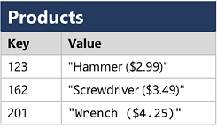
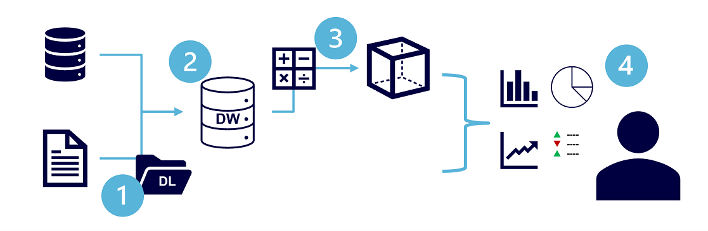

# DP-900

# Describe core data concepts (25—30%)

## Describe ways to represent data

Data is a collection of facts such as numbers, descriptions, and observations used to record information. Data structures in which this data is organized often represents **entities** (EXAM) that are important to an organization (such as *customers*, *products*, *sales orders*, and so on).

Each entity typically has one or more **attributes**, or characteristics (for example, a customer might have a *name*, an *address*, a *phone number*, and so on).

You can classify data as structured, semi-structured, or unstructured.

### Describe features of structured data

Structured data is data that adheres to a **fixed schema**, so all of the data has the **same fields or properties**. Most commonly, the schema for structured data entities is tabular, in other words, the data is represented in one or more tables that consist of rows to represent each instance of a data entity, and columns to represent attributes of the entity.

Structured data is often stored in a database in which multiple tables can reference one another by using key values in a relational model; which we'll explore in more depth later.

Exam:

* Examples:
  * CSV

### Describe features of semi-structured

Semi-structured data is information that has some structure, but which allows for some **variation between entity instances**. For example, while most customers may have an email address, some might have multiple email addresses, and some might have none at all.

One common format for semi-structured data is JavaScript Object Notation (*JSON*).

### Describe features of unstructured data

Not all data is structured or even semi-structured. For example, documents, images, audio and video data, and binary files might not have a specific structure. This kind of data is referred to as unstructured data.

## Identify options for data storage

### Describe common formats for data files

In most organizations, important data files are stored centrally in some kind of shared file storage system. Increasingly, that central storage location is hosted in the cloud, enabling cost-effective, secure, and reliable storage for large volumes of data.

* **Delimited text files**: Data is often stored in plain text format with specific field delimiters and row terminators. The most common format for delimited data is comma-separated values (CSV) in which fields are separated by commas, and rows are terminated by a carriage return / new line. Optionally, the first line may include the field names. Other common formats include tab-separated values (TSV) and space-delimited (in which tabs or spaces are used to separate fields), and fixed-width data in which each field is allocated a fixed number of characters. Delimited text is a good choice for structured data that needs to be accessed by a wide range of applications and services in a human-readable format.

* **JavaScript Object Notation** (JSON): JSON is a ubiquitous format in which a hierarchical document schema is used to define data entities (objects) that have multiple attributes. Each attribute might be an object (or a collection of objects); making JSON a flexible format that's good for both structured and semi-structured data.

* **Extensible Markup Language** (XML): It's largely been superseded by the less verbose JSON format, but there are still some systems that use XML to represent data. XML uses tags enclosed in angle-brackets (<../>) to define elements and attributes.

* **Binary Large Object** (BLOB): Ultimately, all files are stored as **binary data** (1's and 0's), but in the human-readable formats discussed above, the bytes of binary data are mapped to printable characters (typically through a character encoding scheme such as ASCII or Unicode). Some file formats however, particularly for unstructured data, store the data as raw binary that must be interpreted by applications and rendered. Common types of data stored as binary include images, video, audio, and application-specific documents.

* **Optimized file formats**, specialized file formats that *enable compression, indexing, and efficient storage and processing*:
  
  * **Avro** is a *row-based format*. Each record contains a header that describes the structure of the data in the record. This header is stored as JSON. The data is stored as binary information. An application uses the information in the header to parse the binary data and extract the fields it contains. Avro is a good format for compressing data and minimizing storage and network bandwidth requirements.

  * **ORC** (Optimized Row Columnar format) *organizes data into columns rather than rows*. It was developed by HortonWorks for optimizing read and write operations in Apache Hive (Hive is a data warehouse system that supports fast data summarization and querying over large datasets). An ORC file contains stripes of data. Each stripe holds the data for a column or set of columns. A stripe contains an index into the rows in the stripe, the data for each row, and a footer that holds statistical information (count, sum, max, min, and so on) for each column.

  * **Parquet** is another columnar data format. It was created by Cloudera and Twitter. A Parquet file contains row groups. *Data for each column is stored together in the same row group*. Each row group contains one or more chunks of data. A Parquet file includes metadata that describes the set of rows found in each chunk. An application can use this metadata to quickly locate the correct chunk for a given set of rows, and retrieve the data in the specified columns for these rows. Parquet specializes in storing and processing nested data types efficiently. It supports very efficient compression and encoding schemes.

### Describe types of databases

A database is used to define a central system in which data can be stored and queried.

* **Relational databases**: used to store and query structured data. The data is stored in *tables that represent entities*, such as customers, products, or sales orders. *Each instance of an entity is assigned a primary key that uniquely identifies it*; and these keys are used to reference the entity instance in other tables. For example, a customer's primary key can be referenced in a sales order record to indicate which customer placed the order. This use of keys to reference data entities enables a relational database to be normalized; which in part means the elimination of duplicate data values so that, for example, the details of an individual customer are stored only once; not for each sales order the customer places. The tables are managed and queried using **Structured Query Language** (SQL), which is based on an ANSI standard, so it's similar across multiple database systems.
  
  Exam:
  
  * *Auto-scaling is not an option for Azure PaaS relational data resources*. While database administrators can scale databases up or down online, it *must be executed manually*. There is no auto-scaling option.
  
  * A *clustered index* is a data structure associated with a table that defines the order in which rows are stored on a disk.

* **Non-relational databases**: are data management systems that don’t apply a relational schema to the data. Non-relational databases are often referred to as **NoSQL database**, even though some support a variant of the SQL language.

  * **Key-value databases** in which each record consists of a *unique key and an associated value, which can be in any format*.

    

  * **Document databases**, which are a specific form of *key-value* database in which the **value is a JSON** document (which the system is optimized to parse and query)

    

  * **Column family databases**, which store tabular data comprising rows and columns, but you can divide the columns into groups known as column-families. *Each column family holds a set of columns that are logically related together*.
  
    
  
  * **Graph databases**, which store entities as *nodes* with links to define relationships between them (*edges*).

    

## Describe common data workloads

### Describe features of transactional workloads

A transactional system records transactions that encapsulate specific events that the organization wants to track. A transaction could be financial, such as the movement of money between accounts in a banking system, or it might be part of a retail system, tracking payments for goods and services from customers. Think of a transaction as a **small, discrete, unit of work**.

*Transactional systems are often high-volume*, sometimes handling many millions of transactions in a single day. The data being processed has to be accessible very quickly. The work performed by transactional systems is often referred to as **Online Transactional Processing** (*OLTP*).

OLTP solutions rely on a database system in which data storage is optimized for both read and write operations in order to support transactional workloads in which data records are **created, retrieved, updated, and deleted** (often referred to as **CRUD** operations). These operations are applied transactionally, in a way that ensures the integrity of the data stored in the database. To accomplish this, OLTP systems enforce transactions that support so-called **ACID** semantics:

* **Atomicity**: each transaction is treated as a *single unit*, which succeeds completely or fails completely. For example, a transaction that involved debiting funds from one account and crediting the same amount to another account must complete both actions. If either action can't be completed, then the other action must fail.
  
* **Consistency**: transactions can only take the data in the database from one valid state to another. To continue the debit and credit example above, the completed state of the transaction must reflect the transfer of funds from one account to the other.
  
* **Isolation**: *concurrent transactions cannot interfere with one another*, and must result in a consistent database state. For example, while the transaction to transfer funds from one account to another is in-process, another transaction that checks the balance of these accounts must return consistent results - the balance-checking transaction can't retrieve a value for one account that reflects the balance before the transfer, and a value for the other account that reflects the balance after the transfer.

* **Durability**: *when a transaction has been committed, it will remain committed*. After the account transfer transaction has completed, the revised account balances are persisted so that even if the database system were to be switched off, the committed transaction would be reflected when it is switched on again.

OLTP systems are typically used to support live applications that process business data - often referred to as line of business (LOB) applications.

### Describe features of analytical workloads

Analytical data processing typically uses *read-only* (or *read-mostly*) systems that store vast volumes of *historical data or business metrics*. Analytics can be based on a snapshot of the data at a given point in time, or a series of snapshots.

The specific details for an analytical processing system can vary between solutions, but a common architecture for enterprise-scale analytics looks like this:



1. Data files may be stored in a central data lake for analysis.

2. An extract, transform, and load (*ETL*) process *copies data from files and OLTP databases into a data warehouse that is optimized for read activity*. Commonly, a data warehouse schema is based on *fact tables* that contain numeric values you want to analyze (for example, *sales amounts*), with related *dimension tables* that represent the entities by which you want to measure them (for example, *customer or product*),

3. *Data in the data warehouse* may be aggregated and loaded into an online analytical processing (*OLAP*) model, or *cube*. Aggregated numeric values (measures) from fact tables are calculated for intersections of dimensions from dimension tables. For example, sales revenue might be totaled by date, customer, and product.

4. The data in the data lake, data warehouse, and analytical model can be *queried to produce reports*, visualizations, and dashboards.

Data lakes are common in large-scale data analytical processing scenarios, where a large volume of file-based data must be collected and analyzed.

**Data warehouses** are an established way to store data *in a relational schema that is optimized for read operations*, primarily queries to support reporting and data visualization. The data warehouse schema *may require some denormalization of data* in an OLTP data source (introducing some duplication to make queries perform faster).

**Exam**: You typically create *data warehouses to support analytical queries that involve high volume data and generating aggregated values*.

An OLAP model is an aggregated type of data storage that is optimized for analytical workloads. Data aggregations are across dimensions at different levels, enabling you to drill up/down to view aggregations at multiple hierarchical levels; for example to find total sales by region, by city, or for an individual address. B**ecause OLAP data is pre-aggregated, queries to return the summaries it contains can be run quickly**.

## Identify roles and responsibilities for data workloads

### Describe responsibilities for database administrators

Responsible for the design, implementation, maintenance, and operational aspects of on-premises and cloud-based database systems. They're responsible for the overall availability and consistent performance and optimizations of databases. They work with stakeholders to implement policies, tools, and processes for backup and recovery plans to recover following a natural disaster or human-made error.

The database administrator is also responsible for managing the security of the data in the database, granting privileges over the data, granting or denying access to users as appropriate.

### Describe responsibilities for data engineers

Collaborates with stakeholders to *design and implement data-related workloads, including data ingestion pipelines, cleansing and transformation activities, and data stores for analytical workloads*. They use a wide range of data platform technologies, including relational and non-relational databases, file stores, and data streams.

They're also responsible for ensuring that the *privacy of data* is maintained within the cloud and spanning from on-premises to the cloud data stores. They own the management and monitoring of data pipelines to ensure that data loads perform as expected.

### Describe responsibilities for data analysts

Enables businesses to maximize the value of their data assets. They're responsible for *exploring data to identify trends and relationships, designing and building analytical models, and enabling advanced analytics capabilities through reports and visualizations*.

A data analyst processes raw data into relevant insights based on identified business requirements to deliver relevant insights.

# Identify considerations for relational data on Azure (20—25%)

## Describe relational concepts

In a relational database, you model collections of entities from the real world as tables.

An **entity** is described **as a thing about which information needs to be known or held**.

In the ecommerce example, you might create tables for *customers*, *products*, and *orders*.

A table contains **rows**, and each row represents a **single instance of an entity**.

In the ecommerce scenario, each row in the customers table contains the data for a single customer, each row in the products table defines a single product, and each row in the orders table represents an order made by a customer.

The rows in a table have one or more **columns** that define the **properties of the entity**, such as the customer name, or product ID. All rows in the same table have the same columns. **Some columns are used to maintain relationships between tables**.

You design a relational database by creating a **data model**. The **primary key** indicates the column (or combination of columns) that **uniquely identify each row**. Every table should have a primary key.

### Identify features of relational data

* All data is tabular. Entities are modeled as tables, each instance of an **entity** is a **row** in the table, and each **property** is defined as a **column**.

* All rows in the same table have the **same set of columns**.

* A table can contain **any number of rows**.

* A **primary key uniquely identifies each row in a table**. No two rows can share the same primary key.

* A **foreign key references rows in another, related table**. *For each value in the foreign key column, there should be a row with the same value in the corresponding primary key column in the other table*.

### Describe normalization and why it is used

Normalization is the **process of organizing data in a database**. This includes creating tables and establishing relationships between those tables according to rules designed both to protect the data and to make the database more flexible by **eliminating redundancy and inconsistent dependency** (EXAM).

*Redundant data wastes disk space and creates maintenance problems*. If data that exists in more than one place must be changed, the data must be changed in exactly the same way in all locations.

Rules for database normalization:

* **First normal form**

  * Eliminate repeating groups in individual tables.

  * Create a separate table for each set of related data.

  * Identify each set of related data with a primary key.
  
  Do not use multiple fields in a single table to store similar data. For example, to track an inventory item that may come from two possible sources, an inventory record may contain fields for Vendor Code 1 and Vendor Code 2.
  
  What happens when you add a third vendor? Adding a field is not the answer;  place all vendor information in a separate table called Vendors.

* **Second normal form**

  * Create separate tables for sets of values that apply to multiple records.

  * Relate these tables with a foreign key.

  For example, consider a customer's address in an accounting system. The address is needed by the Customers table, but also by the Orders, Shipping, Invoices, Accounts Receivable, and Collections tables. Instead of storing the customer's address as a separate entry in each of these tables, store it in one place, either in the Customers table or in a separate Addresses table.

* **Third normal form**

  * Eliminate fields that do not depend on the key.
  
  For example, in an Employee Recruitment table, a candidate's university name and address may be included. But you need a complete list of universities for group mailings. If university information is stored in the Candidates table, there is no way to list universities with no current candidates. Create a separate Universities table and link it to the Candidates table with a university code key.

Exam:

* **Normalization**: is the process of *splitting a logical entity into multiple tables and designing the relationship between tables*. Normalization is often used to improve query completion speeds for transaction processing databases.

* **Deduplication**: is the process of *removing duplicate data* from tables.

* **Denormalization**: is the process of *combining tables*. This process is often used to store data in databases which are used for data mining and reporting.

* **Optimization**: is the process of modifying fields and database structure to *improve overall performance*.

### Identify common structured query language (SQL) statements

A SQL statement is an atomic unit of work and either *completely succeeds or completely fails*. A SQL statement is a set of instruction that consists of identifiers, parameters, variables, names, data types, and SQL reserved words that compiles successfull.

* **Data Definition Language** (DDL) statements defines data structures. Use these statements to create, alter, or drop data structures in a database. These statements include:

  * ALTER
  * Collations
  * CREATE
  * DROP
  * DISABLE TRIGGER
  * ENABLE TRIGGER
  * RENAME
  * UPDATE STATISTICS
  * TRUNCATE TABLE

* **Data Manipulation Language** (DML) affect the information stored in the database. Use these statements to insert, update, and change the rows in the database.

  * BULK INSERT
  * DELETE
  * INSERT
  * SELECT
  * UPDATE
  * MERGE

### Identify common database objects

* **View**: *virtual table based on the results of a SELECT query*. You can think of a view as a window on specified rows in one or more underlying tables.

* **Stored procedure**: defines SQL statements that can be run on command. Stored procedures are used to *encapsulate programmatic logic in a database* for actions that applications need to perform when working with data.

* **Index**: *helps you search for data in a table*. Think of an index over a table like an index at the back of a book. A book index contains a sorted set of references, with the pages on which each reference occurs. **May decrease INSERT peformance**.

## Describe relational Azure data services

### Describe the Azure SQL family of products including Azure SQL Database, Azure SQL

Azure SQL is a family of managed, secure, and intelligent products that use the SQL Server database engine in the Azure cloud.

* **Azure Data Studio**: is a **cross-platform database tool** that you can use with both on-premises and cloud data platforms on Windows, MacOS and Linux.
  
  Exam:
  
  * ADS supports Jupyter Notebooks; SSMS does not.

  * Exporting query results as CSV, JSON, and Excel are unique to ADS.

  * Azure Data Studio runs on Windows, Linux, or MacOS, but SSMS runs only on select Windows versions.
  
  * ADS provides a means to generate visualizations, whereas SSMS does not.

* **Azure Query editor**: is available in the **Azure portal**. You can use this tool for querying Azure SQL databases.

* **SQL Server Data Tools** is available in **Visual Studio**: You can use this tool to connect to and query on-premises and cloud data services.

  Exam:
  
  * Only SQL Server Management Studio can be used to set up Always Encrypted..


* **Azure SQL Database**: **PaaS** deployment option of Azure SQL that abstracts both the OS and the SQL Server instance away from users. This deployment option allows you to just get a database and start developing applications. SQL Database is also the **only deployment option that supports scenarios that require unlimited database storage (hyperscale) and autoscaling for unpredictable workloads (serverless)**.

* **Azure SQL Managed Instance**: an intelligent fully managed *instance as a service*, with almost 100% feature parity with the SQL Server database engine. Best for most migrations to the cloud.

  Exam:

  * Is used for deployment where you need to have complete feature parity with SQL Server on-premises. You should use a managed instance if your database uses features like SQL Server Agent and Database Mail.

* **SQL Server on Azure VMs**: *Lift-and-shift* your SQL Server workloads with ease and maintain 100% SQL Server compatibility and operating system-level access.


### Managed Instance, and SQL Server on Azure Virtual Machines

* **SQL Managed Instance** is a **PaaS** deployment option of Azure SQL. It gives you an instance of SQL Server, but *removes much of the overhead of managing a virtual machine*. Most of the features available in SQL Server are available in SQL Managed Instance. This option is ideal for customers who want to use instance-scoped features and want to *move to Azure without rearchitecting their applications*.

* **SQL Server on Azure VMs**: Lift-and-shift (IaaS) your SQL Server workloads with ease and maintain 100% SQL Server compatibility and operating system-level access.

### Identify Azure database services for open-source database system

* **MySQL** (oracle): (PaaS - DBaaS) LAMP apps ie., linux ,Apache, MySQL, and PHP

* **Maria DB**: (PaaS - DBaaS) Fork of MySQL

* **PostgreSQL** ( uses pgsql , support custom datatype,manipulate geometric data)
  PostgreSQL in Azure has two services, **Azure Database for PostgreSQL** and Azure **Cosmos DB for PostgreSQL**.

  Azure Database for PostgreSQL is available in two deployment modes, with each deployment mode allowing different levels of customization and scale.

  * **Single Server**: Basic, General Purpose, and Memory Optimized
  * **Flexible Server**: more control and server customizations,better cost optimization
  * **Hyperscale**: database is split across nodes. Data is split into chunks based on the value of a partition key or sharding key

* **EXAM** Ports:
  * SQLServer: 1433
  * MYSQL: 3306
  * Postgres: 5432

* Security:
  * Transparent data encryption (**TDE**)- encrypting data at rest.
  * Transport Layer Security (**TLS**) to encrypt data that is transmitted across a network
  * Dynamic data masking (**DDM**) limits sensitive data exposure by masking it to non-privileged users.

# Describe considerations for working with non-relational data on Azure (15—20%)

## Describe capabilities of Azure storage

**Exam**:

* Supports multiregion writes: Cosmos DB Table API only.
* Supports multiregion reads replicas: Cosmos DB Table API and Az Table storage.

### Describe Azure Blob storage

Blob Storage resources


* **The storage account**: provides a *unique namespace in Azure for your data*. Every object that you store in Azure Storage has an address that includes your unique account name.
* A **container** in the storage account: *organizes a set of blobs, similar to a directory in a file system*. A storage account can include an unlimited number of containers, and a container can store an unlimited number of blobs.
* A **blob** in a container.

Key Points:

* Stores massive amounts of unstructured data as binary large objects, or blobs
* Uses container
* Can read and write blobs inside a container
* Virtual folders similar to file system
* types : Block , Page , Append
  * Block (100 MB) = Max of 50k Blocks = 4.7 TB
  * Page = Into Pages , Fast Read and Write , Max 8 TB
  * Append = Used for append operation ie.,logs . 4MB - 195 GB
* 3 Access
  * hot = high performance
  * cold = low performance , less charges
  * Archive = lowest storage cost , long time to access data

### Azure DataLake Storage Gen2

Key Points:

* newer ver of Gen1
* Advantages = blob storage , cost-control of storage tiers, hierarchical namespace , analytics
* analytical data lakes
* Integrate with Azure HDInsight, Azure Databricks, and Azure Synapse Analytics
* Data Lake Storage Gen2 = Azure Storage + hierarchical namespace checkbox (Under Advanced)
* hierarchical namespace = Folder operations (rename, delete, copy etc.,)
* By creating the storage account, or you can upgrade an existing Azure* Storage account to support Data Lake Gen2
* After Upgrading you can’t revert it to a flat namespace.

### Describe Azure File storage

**Fully managed file shares in the cloud** that are accessible via *Server Message Block* (**SMB**) protocol, *Network File System* (**NFS**) protocol, and *Azure Files REST* **API**.

Azure file shares can be mounted concurrently by cloud or on-premises deployments. SMB Azure file shares are accessible from Windows, Linux, and macOS clients. NFS Azure file shares are accessible from Linux clients.

Key Points:

* 100 TB of data in a single storage account.
* maximum size of a single file is 1 TB
* 2000 Concurrent operations
* upload files using Azure portal, or AzCopy utility.
* Azure File Sync service to synchronize local copy
* 2 Types:
  * Standard: hard disk-based hardware in a datacenter,
  * Premium: uses solid-state disks, greater throughput
* 2 file sharing protocols
  * Server Message Block (SMB): used in all OS
  * Network File System (NFS): Only in some mac and linux (Premium)

* Useful:
  * Replace or supplement on-premises file servers.
  * Lift and shift applications.
  * Simplify cloud development
  * Containerization

### Describe Azure Table storage

Service that stores **non-relational structured data** (also known as structured NoSQL data) in the cloud, providing a **key/attribute store with a schemaless desig**n.

Key Points:

* Row = Key , Value
* each row holding the entire data for a logical entity
* must have a unique key
* no concept of foreign keys, relationships, stored procedures, views,
* denormalized
* The number of fields in each row can be different
* Partition Key
  * used to group related data
  * rows with same partition key are stored together
  * They are independent in size
  * Items in the same partition are stored in row key order.
  * used for faster search and range queries fetch contiguous block of rows

## Describe capabilities and features of Azure Cosmos DB

**Fully managed NoSQL database** designed to provide low latency, elastic scalability of throughput, well-defined semantics for data consistency, and high availability.

Key Points:

* NoSQL DB
* Horz scaling ,High scalability
* Use Api to query Data
* no administraton
* Auto Scale (no limit)
* All features similar to SQL Server
* Can use SQL language to Query NoSQL data
* multi-region writes for globally distributed user local replica
* **Creation**: Account > DB > Container >item Note :Seperate account is needed* for each
* testdeepak/deepak/test-123 , SELECT * FROM SalesLT.Product;

Exam:


### Identify use cases for Azure Cosmos DB

* **IoT and telematics**

  

* **Retail and marketing**

  

* **Gaming**

  

* **Web and mobile applications**

  

### Describe Azure Cosmos DB APIs

Key Points:

* **API for NoSQL**
  * stores data in document format.
  * SQL Support
* **Documents**:
  * Types :
    * **Core SQL API** (Api NoSQL) : **JSON** , SQL syntx
    * **Mongo API** (Binary JSON - **BSON** )
  * Ex: Person(name ,Address()).In RDBMS address will be seperate table
  * Core SQL :DB > Container > Item
  * Mongo : DB >Collection >Doc
* **Table API**
  * key - value 
  * *greater scalability and performance than Azure Table Storage*.
  * Stucture similar to Azure Table
  * GET - <https://endpoint/Customers(PartitionKey=>'1',RowKey='124')
* Column (**Cassandra API**)
  * rows and columns
  * Supports **SQL**
  * Has 1 Primary Key Column
  * Other columns are grouped as 1 column
  * Eg: (Pk=1 ,col2=(name="deepak",ph="123 )), (Pk=2 ,col2=(name="ABC",email="abc@gmail" ))
  * compatible with Apache Cassandra,
  * not mandatory for every row to have the same columns.
  * KeySpace > Table >Row
  * SQL to Query (SELECT * FROM Employees WHERE ID = 2)
  * **Exam**: The Cassandra API is designed for Cassandra databases that already exist. The key here is existing Cassandra applications, and not just any (homegrown) set of wide-column data. *New applications generally should use the Core/SQL API*.
* Key Val :Map or Dict
* **Gremlin API** (graph)
  * used to store complex relationship
  * Uses nodes and edges
  * Eg:Organization Charts
  * Azure Cosmos , Gremlin
  * DB > Garph > Node , Edge
  * EXAM: Example: :> g.V() .hasLabel ('person' ) . order () .by ('firstName', decr)

**Exam**:

* Each Cosmos DB **account supports only 1 API**.

* **Consistency** setting is set at the **account level**.

* Cosmos DB **does not have an API for relational data**, it is a non-relational data resource

* You should use the **Core API to store JSON documents**. This API is used for document-based databases that store semi-structured data in JSON format. A document usually contains all data from an entity, and each document can have different fields of data.

* The **MongoDB API** is appropriate for migrated **BSON** documents.

* **Manual and automatic failover** is a key differentiator for Cosmos DB.

* Azure Cosmos DB allows **simpler queries to retrieve data than a relational database**. Azure Cosmos DB is a NoSQL database that supports storing data in a denormalized way. Denormalization reduces the number of tables within a data model because all attributes from an entity are stored together rather than in different tables. With fewer tables, data read (or retrieval) queries become less complex due to the reduced table joins needed.

* The **firewall always requires a valid authorization token** when accessing data in a Cosmos DB container; this requirement cannot be overridden.

# Describe an analytics workload on Azure (25—30%)

## Describe common elements of large-scale analytics

Data analytics is the process of gathering raw data and examining it to draw conclusions from it.


### Describe considerations for data ingestion and processing

Data from one or more transactional data stores, files, real-time streams, or other sources is loaded into a data lake or a relational data warehouse.

The load operation usually involves an extract, transform, and load (**ETL**) or extract, load, and transform (**ELT**) process in which the data is cleaned, filtered, and restructured for analysis.

In ETL processes, the data is transformed before being loaded into an analytical store, while in an ELT process the data is copied to the store and then transformed. Either way, the resulting data structure is optimized for analytical queries.

The data processing is often performed by distributed systems that can process high volumes of data in parallel using multi-node clusters.

*Data ingestion includes both batch processing of static data and real-time processing of streaming data*.


Exam:

* Extract, Transform, Load (ETL) is the correct approach when you need to filter sensitive data before loading the data into an analytical model. It is suitable for simple data models that do not require Azure Data Lake support.

* Extract, Load, Transform (ELT) is the correct approach because it supports Azure Data Lake as the data store and manages large volumes of data.

### Describe options for analytical data stores

Serves processed data in a structured format that can be queried using analytical tools.

* Serving layer requires strong support for random reads with low latency.
* Batch layer does not need to support random writes, but batch writes instead.

There are several options:

* Azure Synapse Analytics
* Azure Synapse Spark pools
* Azure Databricks
* Azure Data Explorer
* Azure SQL Database
* SQL Server in Azure VM
* HBase/Phoenix on HDInsight
* Hive LLAP on HDInsight
* Azure Analysis Services
* Azure Cosmos DB

These options provide various database models that are optimized for different  types of tasks:

* **Key/value**: **hold a single serialized object for each key value**. They're good for storing large volumes of data where you want to get one item for a given key value and *you don't have to query based on other properties of the item*.

* **Document**: are **key/value databases in which the values are documents**. A "document" in this context is *a collection of named fields and values*. The database typically stores the data in a format such as *XML, YAML, JSON, or BSON*, but may use plain text. Document databases can query on non-key fields and define secondary indexes to make querying more efficient. This makes a document database more suitable for applications that need to retrieve data based on criteria more complex than the value of the document key.

* **Column-family**: are **key/value data stores that structure data storage into collections of related columns called column families**. For example, a census database might have one group of columns for a person's name (first, middle, last), one group for the person's address, and one group for the person's profile information (data of birth, gender). The *database can store each column family in a separate partition, while keeping all of the data for one person related to the same key*. An application can read a single column family without reading through all of the data for an entity.

* **Graph**: store information as a **collection of objects and relationships**. A graph database can efficiently perform queries that traverse the network of objects and the relationships between them. For example, the objects might be employees in a human resources database, and you might want to facilitate queries such as "find all employees who directly or indirectly work for Scott."

* **Telemetry and time series**  are an *append-only* collection of objects. Telemetry databases efficiently index data in a variety of column stores and in-memory structures, making them the optimal choice for storing and analyzing vast quantities of telemetry and time series data.

### Describe Azure services for data warehousing, including Azure Synapse Analytics, Azure Databricks, Azure HDInsight, and Azure Data Factory

#### Azure Synapse Analytics

Azure Synapse brings together the best of *SQL technologies* used in enterprise data warehousing, *Spark* technologies used for big data, *Data Explorer* for log and time series analytics, *Pipelines* for data integration and ETL/ELT, *and deep integration with other Azure services such as Power BI, CosmosDB, and AzureML*.


* Synapse SQL is a **distributed query system for T-SQL** that enables data warehousing and data virtualization scenarios and extends **T-SQL** to address streaming and machine learning scenarios.

* Apache **Spark** for Azure Synapse deeply and seamlessly integrates Apache Spark, the most popular *open source big data engine used for data preparation, data engineering, ETL, and machine learning*.

* Azure Synapse **Data Explorer** provides customers with an *interactive query experience to unlock insights from log and telemetry data*.

* Built-in data integration: contains the **same Data Integration engine and experiences as ADF**, allowing you to create rich at-scale ETL pipelines without leaving Azure Synapse Analytics.

Exam:

* Three components:

  * **Workspaces**
  * **Pipelines**
  * **Az Datalake Storge Gen 2**
  
* The most appropriate use case for Azure Synapse Analytics is to perform *very complex queries and aggregations on a large amount of relational data*. You can provision Synapse SQL pools to quickly execute complex queries across multiple computer nodes thanks to the Synapse SQL massively parallel processing (MPP) architecture.

* **PolyBase**, available in both *Microsoft SQL Server and Azure Synapse Analytics*, is capable of reading data from Hadoop Distributed File System (HDFS) storage, which is represented by the Parquet format.

#### Azure Databricks

Fully managed, cloud-based data analytics platform, which empowers developers to accelerate AI and innovation by simplifying the process of building enterprise-grade data applications.

Is hosted on the Microsoft Azure cloud platform, and integrated with Azure services such as Azure Active Directory, Azure Storage, Azure Synapse Analytics, and Azure Machine Learning.

#### Azure HDInsight

Full-spectrum, **managed cluster platform which simplifies running big data frameworks in large volume and velocity using Apache Spark, Apache Hive, LLAP, Apache Kafka, Apache Hadoop**.

**Big data** is collected in *escalating volumes, at higher velocities, and in a greater variety of formats than ever before*.

Cluster types:

* Apache Hadoop
* Apache Spark
* Apache HBase
* Apache Interactive Query (In-memory caching for interactive and faster Hive queries)
* Apache Kafka


#### Azure Data Factory

**Fully managed, serverless data integration service**. It enables you to visually integrate data sources with *maintenance-free connectors*.

Data integration enables you to collect data from multiple sources, and then load this combined data to a location suitable for data analysis. If necessary, you can transform the data during this process.

It provides a single set of tools and a common management interface for all of your data integration, and supports all of your data sources, wherever they're located:

* Azure
* On-premises
* A third-party public cloud platform

Components:

* **Pipelines**: A logical grouping of activities that perform a specific unit of work. These activities together perform a task. The advantage of using a pipeline is that you can more easily manage the activities as a set instead of as individual items.

* **Activities**: A *single processing step* in a pipeline. Types:

  * Data movement

  * Data transformation
  
  * Control activities

* **Datasets**: Represent data structures within your data stores. These *point to (or reference) the data that you want to use in your activities as either inputs or outputs*.

* **Linked services**: Define the *required connection information* needed for Azure Data Factory to connect to external resources, such as a data source. Azure Data Factory uses these for two purposes: to *represent a data store or a compute resource*.

* **Data flows**: Enable your data engineers to develop *data transformation logic without needing to write code*. Data flows are run as activities within Azure Data Factory pipelines that use scaled-out Apache Spark clusters.

* **Integration runtimes**: Azure Data Factory uses the compute infrastructure to provide the following data integration capabilities across different network environments: data flow, data movement, activity dispatch, and SSIS package execution. In Azure Data Factory, *an integration runtime provides the bridge between the activity and linked services*.


Exam:

* **Synapse Pipelines** is built on the same platform as Azure Data Factory and is used to process directly from within the Azure Synapse Analytics environment.

* **Get data from a source**: you need to create a linked service for Azure Data Factory. The linked service contains details about the data source including the server name and credentials. You must also define a dataset to describe the expected data structure. A dataset stores data retrieved from a data source.

* **Native connectors** let you move data at scale from Azure Databricks to Azure Synapse Analytics, which acts as a single hub for your structured data. From here, the data is available for detailed analysis and reporting, including using Azure Analysis Services to give end-users access to the data.


## Describe consideration for real-time data analytics

### Describe the difference between batch and streaming data

Key points:

* Batch processing
  * multiple data records are collected and stored processed 1 operation.
  * Eg : postpaid Bill
  * Adv : Large Volume of Data , Time can be schdeuled , For Complex Operations
  * DisAdv : Latency , Input Data needs to be prepared
* Stream processing
  * source data is constantly monitored and processed in real time
  * Adv : No Latency ,Real Time , No prep of data

#### Batch processing

Big data solutions often use *long-running batch jobs to filter, aggregate and otherwise prepare the data for analysis*.

Usually, these jobs involve reading source files from scalable storage (like HDFS, Azure Data Lake Store, and Azure Storage), processing them, and writing the output to new files in scalable storage.

The fundamental requirement of such batch processing engines is to scale out computations to handle a large volume of data. Unlike real-time processing, batch processing *is expected to have latencies (the time between data ingestion and computing a result) that measure in minutes to hours*.

#### Streaming processing

Real-time stream processing *consumes messages from either queue or file-based storage, processes the messages, and forwards the result to another message queue, file store, or database*.

Processing may include querying, filtering, and aggregating messages.

Stream processing engines must be able to consume endless streams of data and produce results with *minimal latency*.

Exam:

* Streaming data *tends to be tolerant of non-conforming or even "junk" data*. There may be some data cleansing in a streaming pipeline, but typically the *focus is on quickly loading the data*.


### Describe technologies for real-time analytics including Azure Stream Analytics, Azure Synapse, Data Explorer, and Spark structured streaming

#### Azure Stream Analytics

Stream processing engine that is designed to **analyze and process large volumes of streaming data with sub-millisecond latencies**.

Key capabilities and benefits:

* Ease of use: only takes a few clicks to connect to multiple sources and sinks, creating an end-to-end pipeline.
* Programmer productivity: uses a *SQL query language* that has been augmented with powerful temporal constraints to analyze data in motion.
* Fully managed: **PaaS**.
* Run in the cloud or on the intelligent edge.
* Low total cost of ownership.
* Mission-critical ready.
* Peformance.


#### Azure Synapse

Several scenarios can benefit from this architecture:

* Ingest data from a stream to a data warehouse in near real-time.

* Apply different stream processing techniques (JOINs, temporal aggregations, filtering, anomaly detection, and so on) to transform the data. Then, store the result in the data warehouse.


#### Data Explorer

**Fully managed, high-performance, big data analytics platform that makes it easy to analyze high volumes of data in near real time**. The Azure Data Explorer toolbox gives you an *end-to-end solution for data ingestion, query, visualization, and management*.

By analyzing structured, semi-structured, and unstructured data across time series, and by using Machine Learning, Azure Data Explorer makes it simple to extract key insights, spot patterns and trends, and create forecasting models. Azure Data Explorer is scalable, secure, robust, and enterprise-ready, and is useful for log analytics, time series analytics, IoT, and general-purpose exploratory analytics.


Key points:

* database
* analytics
* ingesting querying batch , streaming data with a time-series element
* a standalone Azure service
* Azure Synapse Data Explorer runtime in an Azure Synapse Analytics workspace.
* **Uses Kusto Query Language (KQL)**
* Query telemetry data that includes a timestamp attribute.

  ```sql
  LogEvents
      | where StartTime > datetime(2021-12-31) 
      | where EventType == 'Error'
      | project StartTime, EventType , Message
  ```

#### Spark structured streaming

Near-real time processing engine that offers end-to-end fault tolerance with exactly-once processing guarantees using **familiar Spark APIs**. *Structured Streaming lets you express computation on streaming data in the same way you express a batch computation on static data*.

The Structured Streaming engine performs the computation incrementally and continuously updates the result as streaming data arrives.

## Describe data visualization in Microsoft Power BI

### Identify capabilities of Power BI

Power BI turn your data processing efforts into analytics and reports that provide real-time insights into your business. Whether your data processing is cloud-based or on-premises, straightforward, or complex, single-sourced or massively scaled, warehoused, or real-time, Azure and Power BI have the built-in connectivity and integration to bring your business intelligence efforts to life.

**Power BI consists of a Microsoft Windows desktop application called Power BI Desktop, an online SaaS (Software as a Service) service called the Power BI service, and mobile Power BI apps that are available on phones and tablets**.

Building blocks of Power BI are:

* **Datasets**: collection of data that you import or connect to.

* **Reports**: (also called visuals) one or more pages of visualizations such as line charts, maps, and treemaps.

* **Dashboards**: something you create in the *Power BI service* or something a colleague creates in the Power BI service and shares with you. It is a single canvas that contains zero or more tiles and widgets.

Exam:

* You can create a dashboard from reports in Power Bi service.

* **NOT** created with Power BI Desktop

* **CANNOT** contain multiple pages.

* Composed by tiles and widgets.

* You should use Power BI service to create an app workspace and share its dashboard. Power BI service allows you to create an app workspace and share reports and dashboards.

* When a Power BI report that has a table visual contains multiple rows, printed, only records that can are displayed will be printed.

* All records print if you design the report by using Report Builder as a paginated report, all records print.

* Only paginated report supports repeatable headers and footers.

* You cannot create paginated reports by using Power BI visuals. You must use Report Builder instead.


Key points:

* data analysts can use to build interactive data visualisations for business users
* Dashboard - Single page coll of reports
* Reports - Collection of visuals with more than 1 page
* Powr BI report Builder = Author and publish paginated reports
* Powr Bi Desktop - create interactive report for Dashboard
* Power Bi Service = Desktop + Dashboard
* Power BI Desktop
  * import data from a wide range of data sources
  * combine and organize into analytics data model
  * create reports that contain interactive visualizations of the data.
* Power BI service
  * reports can be published and interacted with by business users
  * basic data modeling using a web browser (limited functionality)
* Power BI phone app.
* Users can consume reports, dashboards, and apps in the Power BI service.

### Describe features of data models in Power BI

#### Star schemas


* **Fact tables** contain observational or event data values: sales orders, product counts, prices, transactional dates and times, and quantities.

* **Dimension tables** contain the details about the data in fact tables: products, locations, employees, and order types. These tables are connected to the fact table through key columns.

#### Key points

* Facts and Dimensions
* numeric is called measures,entities is called dimensions
  * Eg:  table containing numeric measures for sales (such as revenue or quantity) and dimensions for products, customers, and time.
* model forms a multidimensional structure called cube
* Denormalised Star Scheme (Best practise)
* star Schema is  fact table is related to one or more dimension tables
* Dim = Person Details  , Fact = Transaction done by Person
* hierarchies = drill-up or drill-down to find aggregated values at different levels
* model tab of Power BI Desktop to define your analytical model

### Identify appropriate visualizations for data

* Tables and text: simplest way to communicate data
* Bar and column: Bar charts are designed to compare one or more metrics across categories and, potentially, sub-categories.
* Line: examine trends, often over time.
* Pie: visually compare categorized values as proportions of a total.
* Scatter: compare two numeric measures, identify relationship or correlation
* Maps: compare values for different geographic areas or locations.

## Apendix: Exam

* **Data lakes**: file stores used for high performance access. They can store files containing structured, semi-structured, or unstructured data, or even a mix of the three.

* **Data lakehouses**: a hybrid of a data warehouse and a lake; they store files with an abstracted relational storage layer, which can be queried using SQL.

* **sqlcmd** utility lets you enter Transact-SQL statements, system procedures, and script files at the command prompt.
